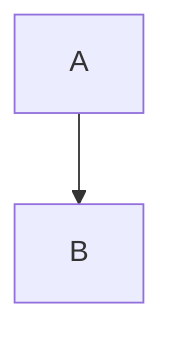
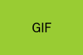

[^abs]: Footnote referenced from the abstract.

# Headings

## Heading with `code`, *emphasis*, [a link](https://example.com), $x^2$ math and a footnote[^h]

### Third level with "quotes" & ampersand_underscore #hash 50%

#### Fourth level

##### Fifth level

###### Sixth level

#### Duplicate heading

#### Duplicate heading

Setext Heading One
==================

Setext Heading Two
------------------

# Skipped levels

#### Jumped straight from level 1 to 4

## Heading with trailing hashes ##

## Émigré café — Ünïcödé heading ✓ 🚀

[^h]: Footnote from a heading is dropped with a warning.

# Inline formatting

Plain, *italic*, _italic_, **bold**, __bold__, ***bold italic***, **bold with *nested italic* inside**,
~~strike~~, `code`, ``code with ` backtick``, and intra_word_underscores and 2*3*4 stars.

Escapes: \* \_ \# \` \\ \{ \} \[ \] \( \) \+ \- \. \! \| \< \> \~ \^ \$ \% \&

Entities: &amp; &lt; &gt; &quot; &copy; &reg; &trade; &mdash; &ndash; &hellip; &nbsp;nbsp &#9731; &#x2603; &euro; &unknown;

LaTeX specials: 100% $ & # _ ^ ~ { } \ and sequences like \textbf{not bold} \begin{document} \input{secret} \\ \newline.

A line ending with two spaces  
continues here, and one with a backslash\
continues there.

Long unbreakable: Supercalifragilisticexpialidocious_Supercalifragilisticexpialidocious_Supercalifragilisticexpialidocious and a long URL https://example.com/this/is/a/very/long/path/that/goes/on/and/on/and/on/forever/and/ever?query=1&other=2#fragment-with-dashes.

Links: [inline](https://example.com/path_(with)_parens?a=b&c=d#e "A title"), [reference][ref], [collapsed][], [shortcut],
<https://auto.example.com/x_y>, <user@example.com>, https://bare.example.com/path, www.example.org,
[relative](./docs/other.md), [anchor](#heading-with-code-emphasis-a-link-x2-math-and-a-footnoteh), [missing anchor](#nope),
[mailto](mailto:me@example.com), [with `code` and **bold**](https://example.com/b), [javascript](javascript:alert(1)).

[ref]: https://example.com/ref_link "Ref title"
[collapsed]: https://example.com/collapsed
[shortcut]: https://example.com/shortcut

Smart punctuation: "double" 'single' it's 'tis '90s rock 'n' roll "nested 'quotes' inside" (parens "quoted") — em, – en, ... ellipsis -> arrow <- back => implies <=> iff.

Superscripts x² y³ H₂O E=mc² 10⁻⁶ and fractions ½ ¼ ¾.

# Lists

- Level 1
  - Level 2
    - Level 3
      - Level 4
        - Level 5
          - Level 6
            - Level 7
              - Level 8
                - Level 9
                  - Level 10 (too deep)

1. Ordered
   1. Nested ordered
      1. Third
         - mixed bullet
2. Second
10. Jumped number

3) Paren style
4) Second paren

* star bullet
+ plus bullet
- dash bullet

- Item with paragraph

  Second paragraph in the item.

  ```js
  const inList = true; // code inside a list item
  ```

  > quote inside a list item

  | a | b |
  |---|---|
  | 1 | 2 |

- [ ] task open
- [x] task done
  - [ ] nested task
- [bracket] first
- *emphasis first*
- 

-
- empty item above

- **Bold**: label style item with `code` and a [link](https://example.com).

# Tables

| Left | Center | Right |
|:-----|:------:|------:|
| a | b | c |
| longer text here | `code` | **12.5** |
| pipe \| inside | [link](https://example.com) | $x_1$ |

| One column only |
|---|
| single |

| Header only |
|---|

| Wide | table | with | many | columns | and | long | headers |
|------|-------|------|------|---------|-----|------|---------|
| 1 | 2 | 3 | 4 | 5 | 6 | 7 | 8 |
| lorem | ipsum | dolor | sit | amet | consectetur | adipiscing | elit |

| Feature | Description |
|---------|-------------|
| Wrapping | This cell contains a very long description that goes on and on so that the column must wrap over several lines in the final PDF without breaking the layout of the page |
| Line<br>breaks | first line<br>second line<br>third line |
| Empty | |
| Special | 50% & # _ ~ ^ { } \ $ |
| [bracket start | *star start |

Table inside a quote:

> | q1 | q2 |
> |----|----|
> | x  | y  |

# Code

```python
def hello(name: str) -> None:
    """Greet someone."""
    print(f"Hello, {name}!")  # trailing comment


if __name__ == "__main__":
    hello("world")
```

```
no language, with tabs:	a	b
	indented with a tab
and a very long line: aaaaaaaaaaaaaaaaaaaaaaaaaaaaaaaaaaaaaaaaaaaaaaaaaaaaaaaaaaaaaaaaaaaaaaaaaaaaaaaaaaaaaaaaaaaaaaaaaaaaaaaaaaaaaaaaaaaaaaaaaaaaaaaaaaaaaaaa
and a long sentence of words that should wrap at spaces because it is longer than the line width of the page, wrapping nicely and keeping indentation
```

~~~bash
# tilde fence
echo "$HOME" | sed 's/a/b/' > /dev/null
~~~

    indented code block
    second line

```
├── src/
│   ├── main.py      ← entry point
│   └── utils.py     → helpers ✓
└── README.md        ★
```

```text
\end{mdverb} and \begin{document} inside code, plus $ % & # _ ^ ~ { } \
```



```math
a^2 + b^2 = c^2
```

# Quotes

> Level one quote with *emphasis*.
>
> > Level two quote.
> >
> > > Level three quote with `code`.
>
> Back to level one, with a list:
>
> 1. one
> 2. two

> ## Heading inside a quote
> And a code block:
>
> ```
> code in quote
> ```

> [!WARNING]
> Careful with **GitHub-style** alerts.

> [!TIP] Custom title
> Body of the tip.

***

___

- - -

# Math

Inline: $E=mc^2$, $\alpha+\beta=\gamma$, $\frac{a}{b}$, $a_{1}^{2}$, \(x\) and $$y$$ display inline.

Not math: $5 and $10, a price of $3.50, and "$" alone. Escaped \$not math\$.

$$
\sum_{i=1}^{n} i = \frac{n(n+1)}{2}
$$

$$ a = b \\ c = d $$

$$
a &= b \\
c &= d
$$

\[
\mathbf{A}\mathbf{x} = \mathbf{b}
\]

\begin{align}
f(x) &= (x+1)^2 \\
     &= x^2 + 2x + 1
\end{align}

Unicode math: $α + β ≤ γ → δ$ and $x²$.

Blocked: $\input{/etc/passwd}$ and $\write18{ls}$ and $^^5cinput{x}$.

Percent in math: $50% \text{of}$ and hash $a#b$.

# Footnotes

Here is a footnote.[^1] Another one with formatting.[^fmt] The first again.[^1] And an undefined one.[^nope]

[^1]: Simple footnote.
[^fmt]: Footnote with **bold**, `code`, a [link](https://example.com), and
    a second line.

    And a second paragraph.

# HTML

<!-- a comment that must disappear -->

<div align="center">
  <b>Centered bold</b> and <i>italic</i> and <kbd>Ctrl</kbd>+<kbd>C</kbd>, H<sub>2</sub>O, x<sup>2</sup>, <u>underline</u>, <mark>mark</mark>, <del>deleted</del>.<br>
  Second line after a break with <a href="https://example.com/html_link">an HTML link</a>.
</div>

<details>
<summary>Click to expand</summary>

Hidden content inside details.

</details>

<h3>HTML heading</h3>

<p>An HTML paragraph with <code>code</code> &amp; entities.</p>

<!-- pagebreak -->

<div style="page-break-after: always;"></div>

Inline html in a paragraph: this is <b>bold</b>, <span style="color:red">span</span>, <unknown>tag</unknown>, and a <br> break.

\newpage

# Images





[](https://example.com) [](https://example.com)

Inline image  inside a sentence, and an HTML image: .

<p align="center"></p>


# Unicode

Accents: àáâãäå èéêë ìíîï òóôõö ùúûü ñ ç ß ø å æ œ ł đ ő ű ą ę.

Symbols: © ® ™ § ¶ † ‡ • ‣ ° ± × ÷ ¿ ¡ « » ‹ › „ “ ” ‚ ‘ ’ € £ ¥ ¢.

Math symbols: ∀ ∃ ∅ ∈ ∉ ⊂ ⊆ ∪ ∩ ∧ ∨ ¬ ⇒ ⇔ ∴ ∑ ∏ ∫ √ ∞ ≈ ≠ ≤ ≥ ± ∂ ∇ ℝ ℕ ℤ ℚ ℂ.

Arrows: ← → ↑ ↓ ↔ ⇐ ⇒ ⇔ ↦ ➔ ➜ ➡ ⬅.

Greek: α β γ δ ε ζ η θ λ μ π σ φ ω Γ Δ Θ Λ Ξ Π Σ Φ Ψ Ω.

Check marks and shapes: ✓ ✔ ✗ ✘ ✅ ❌ ☐ ☑ ☒ ★ ☆ ⭐ ● ○ ◆ ■ □ ▲ ▶ ♠ ♥ ♦ ♣ ⚠ ℹ ❓ ❗.

Emoji (removed): 😀 🚀 🎉 👨‍👩‍👧‍👦 👍🏽 🇺🇸 1️⃣ ❤️ ✨ 🔥.

Invisible characters: zero​width space, soft­hyphen, non breaking space, word‍joiner, bominside.

Other scripts: Привет мир (Russian), Γειά σου κόσμε (Greek), 你好，世界 (Chinese), こんにちは (Japanese), مرحبا (Arabic), שלום (Hebrew).

# End

Final paragraph. Done.
